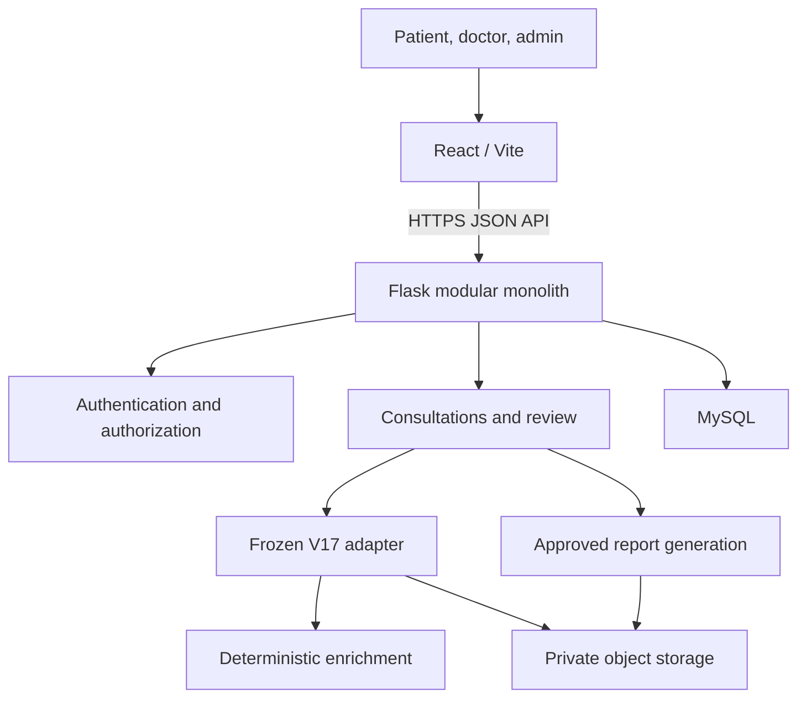

# AYUR-SAGE Master Architecture v1

**Date:** 2 October 2026

**Status:** Proposed target architecture; implementation claims require code and test evidence.

## Purpose and safety boundary

AYUR-SAGE is intended to be a cloud-deployable Ayurvedic recommendation and clinical decision-support application. It must not independently diagnose disease or create doctor prescriptions. Patient-supplied data, frozen model recommendations, deterministic enrichment, and doctor-authored approved content remain separately identifiable.

The V17 experiment is frozen. The application will consume its original `predict_single()` contract only after the original model artifact, source, trusted checksum, dependency evidence, and authorized reference cases are available. The application must not retrain, refit, regenerate encoders, recreate labels, invent categories, or substitute a dummy model.

## Scope

The first release targets one clinic/project environment, a single primary role per account, one patient profile per patient account, one active doctor assignment per consultation, and repeat consultations. Dependents, multi-clinic tenancy, billing, video, real-time chat, automated medical email, and real-world clinical validation are out of scope.

## Logical topology

React communicates only with Flask. The browser must never receive database credentials or model artifacts. The backend is one deployable application with internal Python module boundaries; the model is not a separate deployed service.

## Technology decisions

- React and Vite for the browser application.
- Flask application factory and modular monolith for the API.
- SQLAlchemy and Alembic with MySQL for persistence and migrations.
- Frozen V17 inference through the original `predict_single()` behavior.
- Existing Clinical Reasoning, Lifestyle, and Yoga engines, integrated once supplied and audited.
- ReportLab for PDFs generated from immutable approvals.
- Private object storage for models, reports, and permitted attachments.
- JWT access authentication, stateful refresh rotation, role checks, resource ownership, assignment checks, and auditing.
- Docker and Azure Static Web Apps, Container Apps, MySQL Flexible Server, Blob Storage, and Container Registry as the intended deployment mapping.

No Node/Express backend, second backend framework, independently deployed ML service, LLM layer, Kubernetes, Redis, Kafka, RabbitMQ, or API Gateway is planned.

## Roles and authorization

- **Patient:** maintains their own profile and consultations and may download only their released approved reports.
- **Assigned doctor:** sees assigned cases, verifies inputs, reviews each recommendation, writes care notes/prescriptions, and approves or rejects eligible cases.
- **Administrator:** manages accounts, privileged onboarding, assignments, and operational health without default access to clinical content.

Every protected backend operation checks authentication, active status, role, resource relationship, and workflow state. A resource identifier and a hidden frontend route are not authorization. Public registration cannot select Doctor or Admin.

## Backend modules

The modular monolith will contain `auth`, `users`, `patients`, `consultations`, `predictions`, `ml`, `reasoning`, `lifestyle`, `yoga`, `hitl`, `reports`, `storage`, `audit`, `admin`, and `common` modules. Routes validate transport input; services enforce business rules and transactions; SQLAlchemy models represent persisted state; adapters isolate external storage and frozen inference.

The application factory constructs configuration, extensions, routes, and services. Training code must never execute during application import or startup.

## Frozen V17 boundary

Validated 12-feature snapshot → original `predict_single()` preprocessing/inference → four original outputs → supplied deterministic engines → assigned-doctor review.

The reported features are Disease, Symptom Severity, Nadi Reading, Constitution/Prakriti, Stress Levels, Sleep Patterns, Age Group, Physical Activity Levels, BP Systolic, BP Diastolic, Pulse Rate, and Weight (kg). Their exact names, ordering, categories, units, precision, and missing-value behavior remain **unverified** and must not be encoded until extracted from original V17 evidence.

The reported outputs are Herbal Therapy Strategy, Lifestyle Recommendations, Therapeutic Yoga Module, and Follow-up Recommendation. Prescription is doctor-authored, not a fifth prediction. These names and all class labels still require source verification.

Startup integration must retrieve a pinned artifact, verify it against a trusted manifest checksum, load it in the evidenced dependency environment, validate metadata, run a known reference inference, and only then declare ML readiness. Raw output is immutable; later enrichment and doctor modification are stored separately. Confidence fields are recorded only if the original interface actually supplies them.

**Current state:** ML integration is intentionally unavailable. No model artifact, `predict_single()` implementation, dependency evidence, checksum, or reference cases are present.

## Workflow and data integrity

Consultation states are `DRAFT`, `SUBMITTED`, `PENDING_DOCTOR_REVIEW`, `NEEDS_INFORMATION`, `APPROVED`, `REJECTED`, and `CANCELLED`. Prediction runs independently move through `PENDING`, `RUNNING`, and `SUCCEEDED` or `FAILED`; reports move through `PENDING`, `GENERATING`, and `READY` or `FAILED`.

Inputs, runs, enrichment, reviews, approvals, and reports are versioned. Successful prediction persistence contains exactly four distinct target outputs atomically. Only the current reviewable revision and assigned doctor may approve. Approval binds an immutable snapshot of inputs, predictions, enrichment, decisions, and doctor notes. Changes require a new version and approval. Optimistic row versions and database uniqueness prevent stale or duplicate approvals.

## Persistence outline

The planned relational entities are roles, users, doctor profiles, patients, consultations, clinical inputs, model versions, predictions, prediction outputs, enrichment results, doctor reviews, review decisions, prescriptions, approvals, reports, file metadata, refresh sessions, and audit logs. Foreign keys, uniqueness, required fields, and appropriate indexes enforce relationships. Long inference or storage calls must not hold open database transactions.

## API and security

The API will use versioned JSON routes under `/api/v1`. Consultation-bound endpoints—not a generic patient prediction endpoint—will own submission, processing, review, approval, and reporting. Safe errors include request identifiers and never expose stack traces, SQL, secrets, or clinical payloads.

Access JWTs are short lived and held in browser memory. Rotating refresh credentials use Secure, HttpOnly cookies with server-side session state and appropriate origin/CSRF defenses. Passwords use a maintained one-way hasher. CORS is an exact allowlist. TLS, size limits, output escaping, login throttling shared across replicas, least privilege, managed secrets, and privileged-role MFA are release controls.

## Files, reports, and deployment

Models, reports, and attachments use separate private storage scopes. Backend-controlled opaque keys prevent path selection by clients. PDFs are rendered only from immutable approval snapshots and streamed through Flask after authorization. Attachments remain constrained or disabled until validation and scan/quarantine policy are real.

The intended Azure mapping is Static Web Apps for React, Container Apps with Gunicorn for Flask, MySQL Flexible Server, Blob Storage, Container Registry, managed identity, managed secrets/Key Vault as needed, and Azure monitoring. Availability, region, quota, networking, and cost must be verified before deployment.

## Operations and acceptance

CI must check frontend builds, backend tests, migrations, authorization, workflows, and V17 parity whenever inference/runtime files change. Releases record source commit, image digest, schema revision, model checksum, and engine versions. Liveness means the process runs; readiness will additionally reflect required dependencies and verified model availability without exposing sensitive details.

Acceptance requires model parity, strict input validation, patient ownership isolation, assigned-doctor scope, controlled role assignment, workflow/version/concurrency integrity, atomic four-output persistence, report correctness, recoverable cross-system failures, deployable health checks, exercised restoration, and evidence-backed documentation.

Synthetic agreement is not clinical efficacy. Human review is a governance control, not proof of clinical validation.
