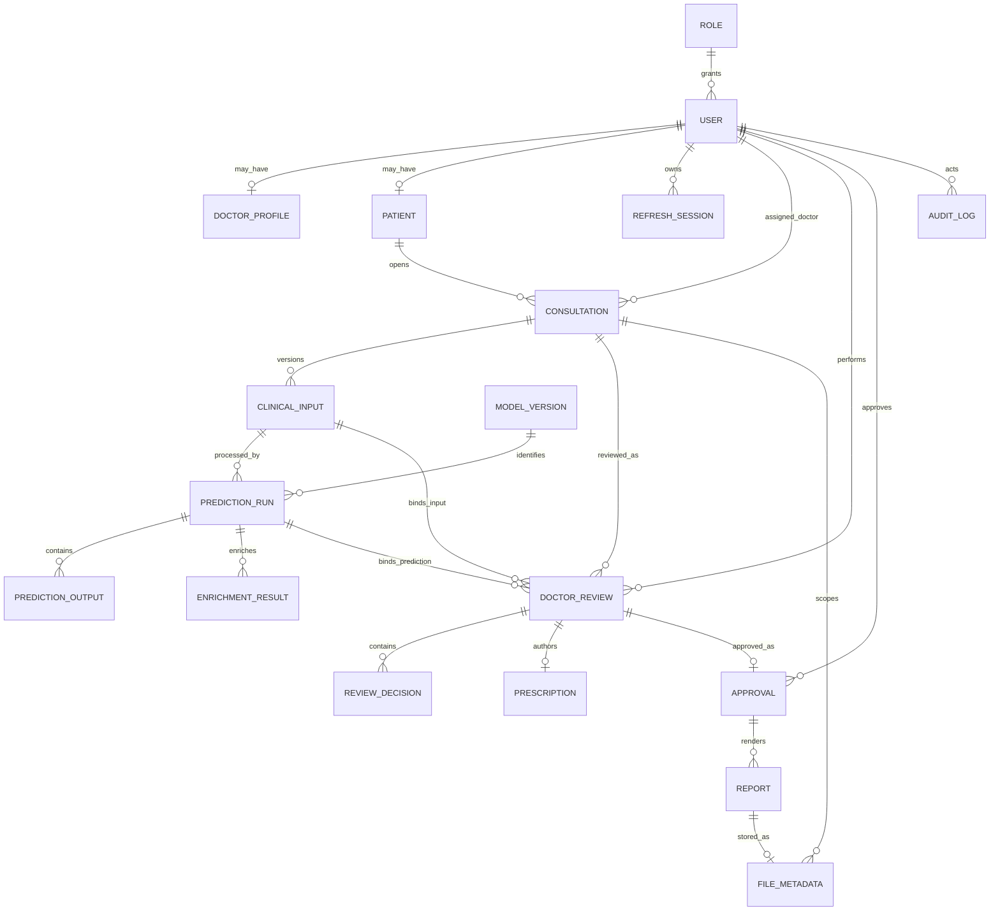

# AYUR-SAGE logical data model

**Status:** Phase 2 application design; column types and migrations follow in the persistence phase.

The Phase 3 physical schema and remaining service integrity requirements are recorded
in [persistence implementation](persistence.md). Clinical vocabularies remain evidence-gated.

The model separates identity, versioned patient input, immutable raw inference, deterministic enrichment, doctor review, approval, reports, files, sessions, and audit history. It does not encode unverified V17 categories or class labels.

## Entity-relationship diagram

## Entity responsibilities and constraints

| Entity | Responsibility | Required integrity rules |
|---|---|---|
| `roles` | One primary role code per account | Unique immutable code; seeded only with reviewed application roles. |
| `users` | Login identity and lifecycle | Unique normalized email; password hash only; active flag; role FK; UTC timestamps. |
| `doctor_profiles` | Privileged onboarding metadata | Unique user FK; doctor role required by service; verification status/provenance. |
| `patients` | One patient profile per patient account | Unique user FK; no ML feature defaults. |
| `consultations` | Workflow aggregate and assignment | Patient FK; nullable active assigned-doctor FK until assigned; state; current input revision; optimistic `row_version`. |
| `clinical_inputs` | Immutable submitted input revisions and mutable draft representation under service rules | Unique `(consultation_id, revision)`; payload/schema version; actor and provenance; verification metadata; no unverified V17 enum constraints. |
| `model_versions` | Trusted artifact identity | Unique version and checksum; object key; metadata/runtime reference; enabled status does not bypass readiness. |
| `prediction_runs` | Technical processing attempt for one input and model | Input/model FKs; status; request/run IDs; timestamps; failure code; idempotency uniqueness. |
| `prediction_outputs` | Original frozen result records | Unique `(prediction_run_id, target_code)`; opaque class identifier/label fields until evidenced; immutable after successful run. |
| `enrichment_results` | Per-engine result/failure | Unique `(prediction_run_id, engine_name, engine_version)`; explicit status; structured result; failure code. |
| `doctor_reviews` | Review bound to exact input and prediction | Consultation/input/run/reviewer FKs; status; expected consultation row version; timestamps. |
| `review_decisions` | One decision per evidenced target | Unique `(doctor_review_id, target_code)`; `ACCEPT`, `EDIT`, or `OVERRIDE`; edit/override reason required by service/database checks where supported. |
| `prescriptions` | Doctor-authored care notes and optional medication content | Unique review FK; explicit care-notes completion; never populated from prediction output. |
| `approvals` | Immutable approved content snapshot | Unique review FK and active version constraints; approver; snapshot/checksum; UTC approval time. |
| `reports` | Rendering lifecycle for an approval | Approval/version uniqueness; status; deterministic object identity; failure/retry metadata. |
| `file_metadata` | Backend-controlled object reference | Opaque key; owner/scope; media type; byte size; checksum; scan/lifecycle status. |
| `refresh_sessions` | Refresh-token rotation and revocation | User FK; unique token identifier/hash; expiry; revocation/replacement chain; never store raw credential. |
| `audit_logs` | Append-oriented business event history | Actor when applicable; event; resource/revision; UTC time; request ID; structured safe metadata. |

## Version and immutability rules

1. Submitted clinical inputs are never overwritten; correction creates the next revision.
2. A prediction run binds exactly one input revision and one trusted model version.
3. Prediction outputs are written with run success in one short transaction; incomplete output sets cannot be successful.
4. Enrichment records never overwrite raw prediction output.
5. A review binds exact input and prediction identifiers, not merely the consultation's current pointers.
6. Approval snapshots bind input, raw output, enrichment, decisions, prescription/care notes, reviewer, and versions.
7. Approved data is immutable. Correction uses an amendment/new revision and a new approval/report version.
8. Report generation failure does not invalidate approval.
9. Database transactions do not remain open during model execution or object-storage network operations.
10. Clinical history must not be cascade-deleted without an explicit, reviewed retention/anonymization policy.

## Decisions still required before migrations

- Exact SQL types and length limits after API/contract review.
- Retention, anonymization, and administrative deletion policy.
- Whether a consultation may temporarily be unassigned after submission.
- Amendment/supersession representation for approved consultations and reports.
- Which clinical-input fields use structured columns versus versioned structured payloads.
- Attachment enablement and quarantine/scan policy.
