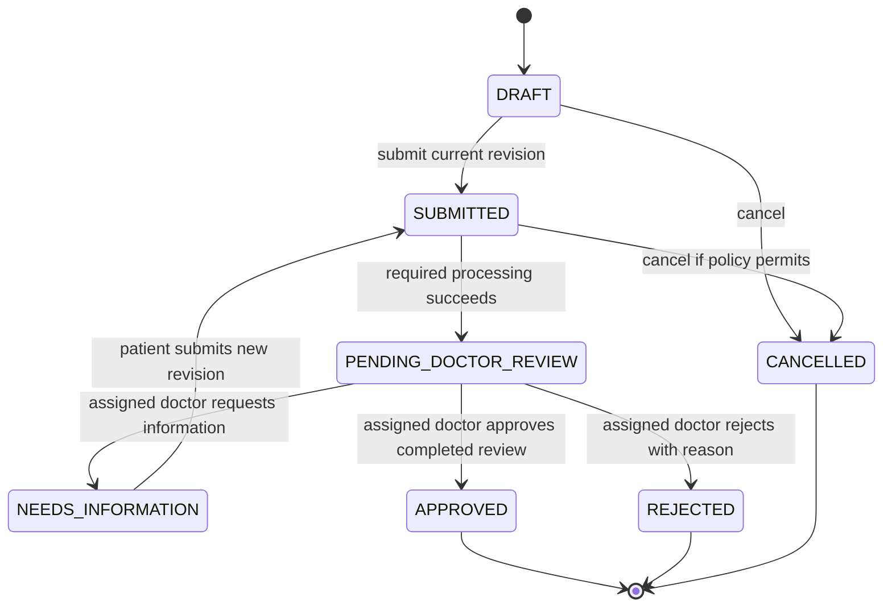
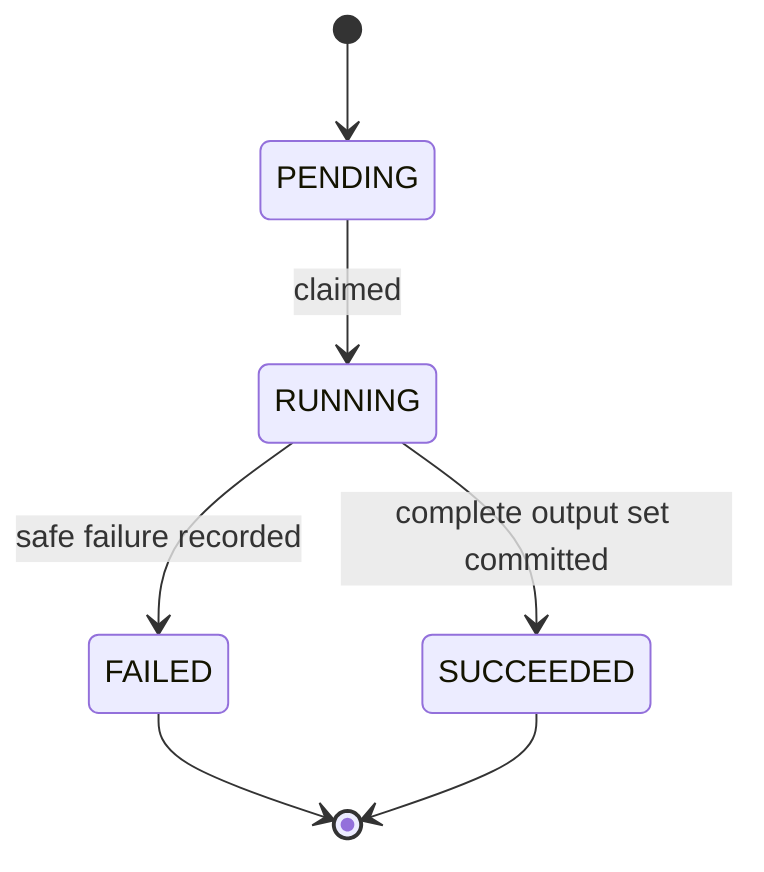
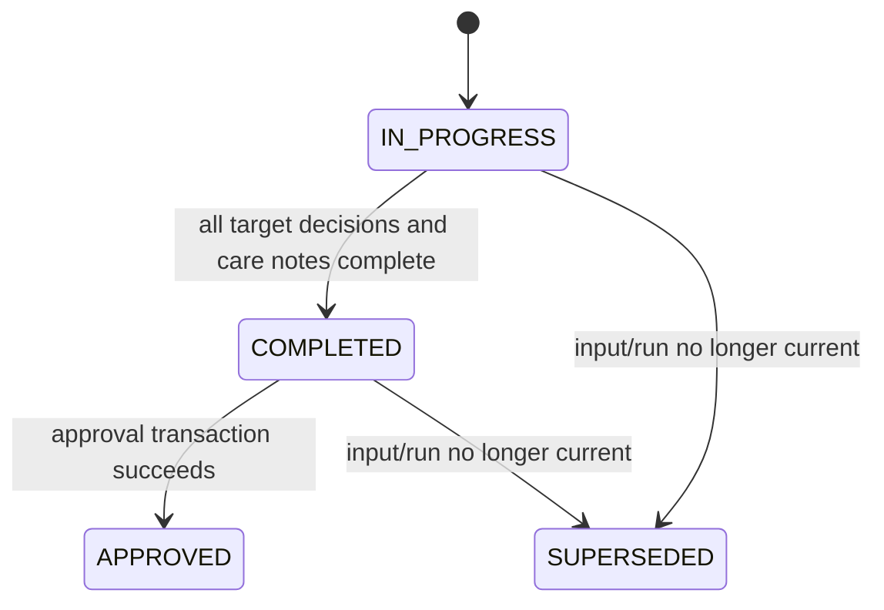
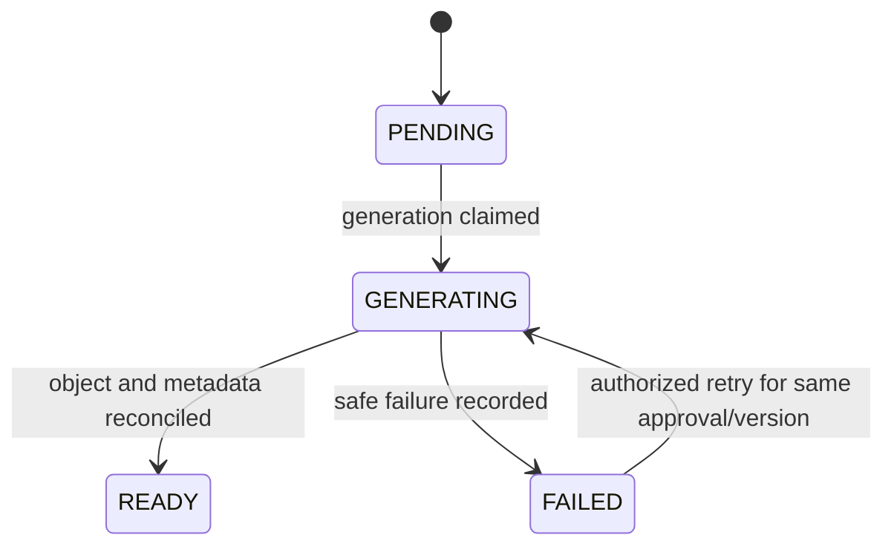

# Consultation, prediction, review, and report states

Business workflow and technical processing are separate state machines. A processing failure never becomes a clinical rejection.

## Consultation state machine

| State | Meaning | Permitted actor/actions |
|---|---|---|
| `DRAFT` | Patient is editing an uncommitted current revision. | Owning patient may edit, submit, or cancel. |
| `SUBMITTED` | A revision is committed and required processing is pending/running/retryable. | Services may create eligible run attempts; authorized users see safe status. |
| `PENDING_DOCTOR_REVIEW` | Required prediction and enrichment records succeeded for the current revision. | Assigned doctor reviews, requests information, rejects, or approves a completed review. |
| `NEEDS_INFORMATION` | Assigned doctor requested a correction or context. | Owning patient may prepare and resubmit a new revision; prior records remain preserved. |
| `APPROVED` | One immutable content snapshot is approved. | Authorized report generation/download; later correction requires amendment design. |
| `REJECTED` | Doctor clinically declined approval with a recorded reason. | Terminal for this workflow revision. |
| `CANCELLED` | Workflow ended under cancellation policy. | Terminal. |

## Prediction-run state machine

A retry is a new run attempt with its own identifier; it does not rewrite the failed run. Eligibility is bound to the current submitted input revision. Only an evidenced complete target set may transition atomically to `SUCCEEDED`.

## Review state machine

Approval checks assignment, reviewer identity, current revision/run, expected row version, complete decisions, care-note completion, and absence of required enrichment failure in one transaction. Edit and override decisions require a reason. Medication content is optional.

## Report state machine

Report retries reuse the immutable approval snapshot and deterministic report identity. Approval remains valid when report generation fails.

## Cross-machine invariants

- Only the owning patient may submit their eligible consultation revision.
- Only the assigned active doctor may view pending raw recommendations, review, reject, or approve.
- Admin assignment authority does not grant clinical-content access by default.
- Input change invalidates reviewability of older runs but never deletes them.
- Exactly one approval may bind a review; duplicate clicks are idempotent or return a conflict.
- No patient-facing approved content or report exists before approval.
- Technical failure exposes a safe failure/retry state and never fabricates output.

## Phase 6 persistence semantics

Each draft save inserts a new immutable-content review revision. The prior eligible
review becomes `SUPERSEDED`; its decisions and notes are retained unchanged. The new
review is `IN_PROGRESS` or `COMPLETED` according to target/notes completeness. A
completed draft still requires explicit approval and clinical-policy verification.

Approval locks and rechecks authority, consultation version, exact current input/run
and latest review revision. Its immutable snapshot, checksum, audit and both APPROVED
states commit together. Exact approval replays are idempotent and never create a
second snapshot. Default live approval is blocked by missing clinical policy.

The assigned doctor may request information before approval, moving the case to
`NEEDS_INFORMATION` and superseding reviewability of the old revision. The owning
patient creates a new input revision; fresh inference/review is required. Live
inference remains gated. APPROVED is terminal: corrections and reassignment are
rejected until an amendment policy is approved. See the concrete proposal and
verification limits in [Phase 6 acceptance](phase6-acceptance.md).
